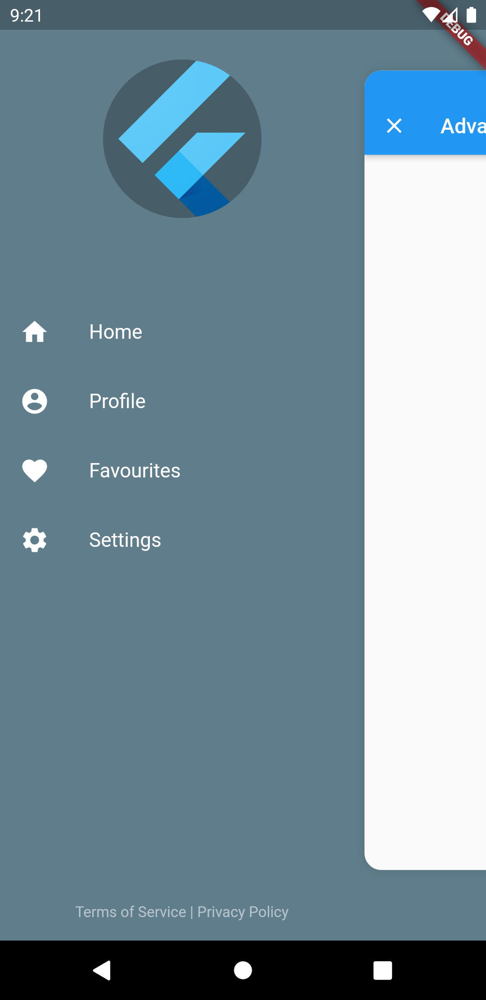
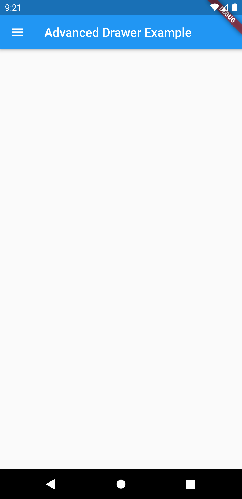

# flutter_advanced_drawer
An advanced drawer widget, that can be fully customized with size, text, color, radius of corners.

## Advanced Drawer States
| Drawer Open State | Drawer Closed State |
|:-:|:-:|
|  |  |

## AdvancedDrawer Parameters
|Parameter|Description|Type|Default|
|:--------|:----------|:---|:------|
|`child`|Screen widget|*Widget*|required|
|`drawer`|Drawer widget|*Widget*|required|
|`controller`|Widget controller|*AdvancedDrawerController*| |
|`backdropColor`|Backdrop color|*Color*| |
|`openRatio`|Opening ratio|*double*|0.75|
|`openScale`|Opening child scale factor|*double*|0.85|
|`animationDuration`|Animation duration|*Duration*|300ms|
|`animationCurve`|Animation curve|*Curve*|Curves.easeInOut|
|`childDecoration`|Child container decoration|*BoxDecoration*|Shadow, BorderRadius|
|`animateChildDecoration`|Indicates that [childDecoration] might be animated or not.|*bool*|true|
|`rtlOpening`|Opening from Right-to-left.|*bool*|false|
|`disabledGestures`|Disable gestures.|*bool*|false|

## Preview
| Preview Tap | Preview Gesture |
|:-:|:-:|
|  |  |
