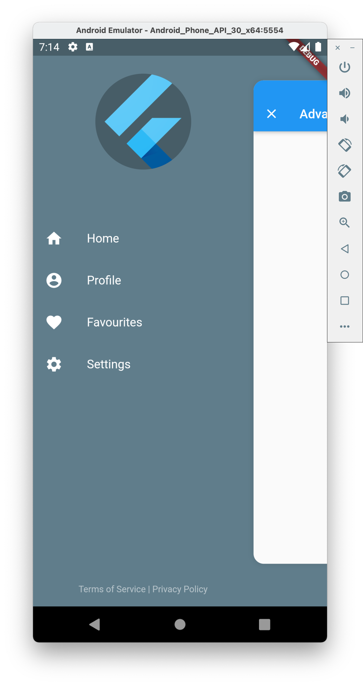
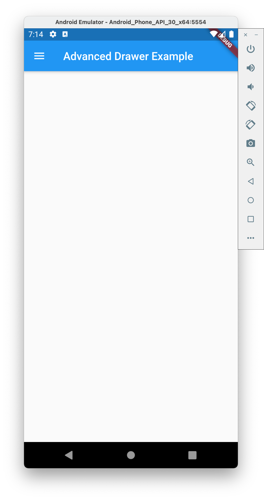

# flutter_advanced_drawer
An advanced drawer widget, that can be fully customized with size, text, color, radius of corners.

| Switch OFF State | Switch ON State |
|:-:|:-:|
|  |  |

## AdvancedDrawer Parameters
|Parameter|Description|Type|Default|
|:--------|:----------|:---|:------|
|`child`|Screen widget|*Widget*|required|
|`drawer`|Drawer widget|*Widget*|required|
|`controller`|Widget controller|*AdvancedDrawerController*| |
|`backdropColor`|Backdrop color|*Color*| |
|`openRatio`|Opening ratio|*double*|0.75|
|`animationDuration`|Animation duration|*Duration*|300ms|
|`animationCurve`|Animation curve|*Curve*|Curves.easeInOut|
|`childDecoration`|Child container decoration|*BoxDecoration*|Shadow, BorderRadius|
