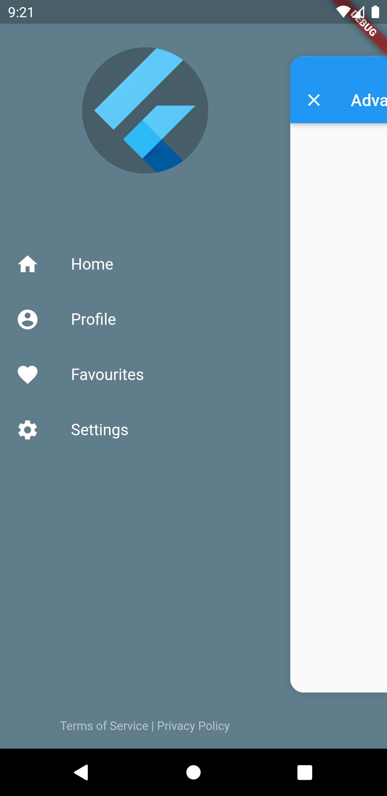
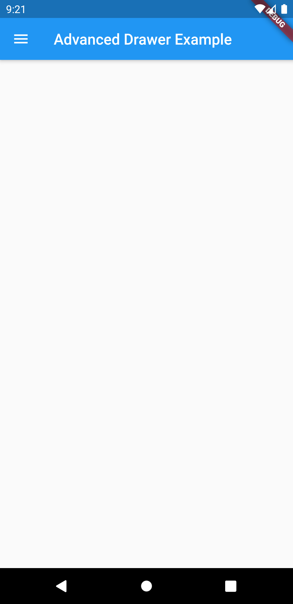

# flutter_advanced_drawer

An advanced drawer widget, that can be fully customized with size, text, color, radius of corners.

## Advanced Drawer States

|                  Drawer Open State                  |                  Drawer Closed State                  |
| :-------------------------------------------------: | :---------------------------------------------------: |
|  |  |

## AdvancedDrawer Parameters

| Parameter                  | Description                                                | Type                       | Default              |
| :------------------------- | :--------------------------------------------------------- | :------------------------- | :------------------- |
| `child`                    | Screen widget                                              | _Widget_                   | required             |
| `drawer`                   | Drawer widget                                              | _Widget_                   | required             |
| `controller`               | Widget controller                                          | _AdvancedDrawerController_ |                      |
| `backdropColor`            | Backdrop color                                             | _Color_                    |                      |
| `backdrop`                 | Backdrop widget for custom background                      | _Widget_                   |                      |
| `openRatio`                | Opening ratio                                              | _double_                   | 0.75                 |
| `openScale`                | Opening child scale factor                                 | _double_                   | 0.85                 |
| `animationDuration`        | Animation duration                                         | _Duration_                 | 300ms                |
| `animationCurve`           | Animation curve                                            | _Curve_                    | Curves.easeInOut     |
| `childDecoration`          | Child container decoration                                 | _BoxDecoration_            | Shadow, BorderRadius |
| `animateChildDecoration`   | Indicates that [childDecoration] might be animated or not. | _bool_                     | true                 |
| `rtlOpening`               | Opening from Right-to-left.                                | _bool_                     | false                |
| `disabledGestures`         | Disable gestures.                                          | _bool_                     | false                |
| `initialDrawerScale`       | How large the drawer segment should scale from.            | _double_                   | 0.75                 |
| `drawerSlideRatio`         | How far the drawer segment should slide with the content.  | _double_                   | 0                    |
| `drawerCloseSemanticLabel` | Semantic label for the close drawer button.                | _String_                   | 'Close drawer'       |

## Preview

|                     Preview Tap                     |                  Preview Gesture                   |
| :-------------------------------------------------: | :------------------------------------------------: |
|  |  |
